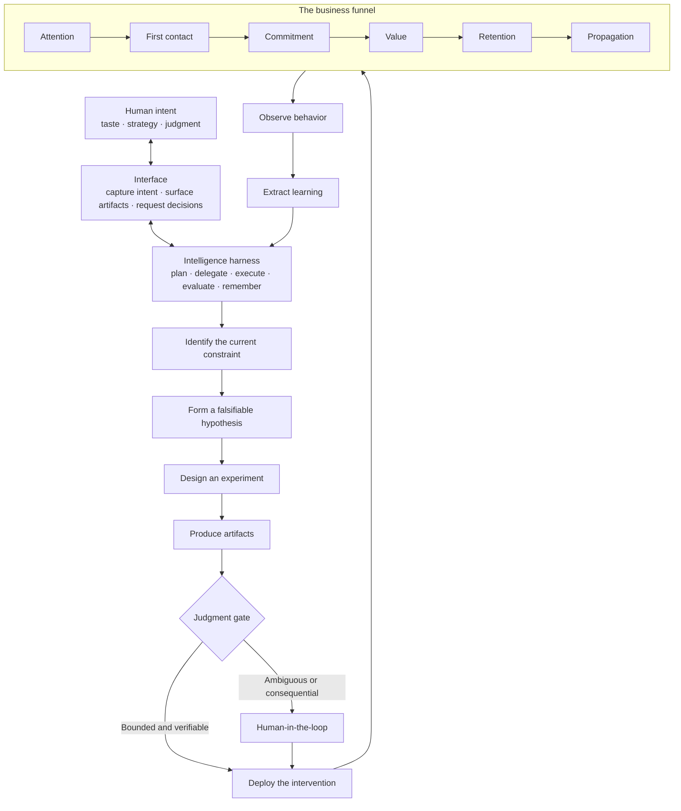
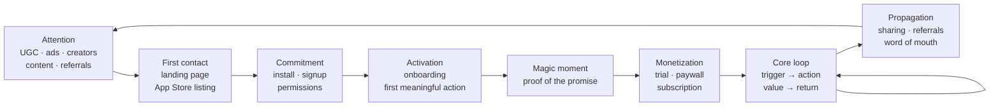
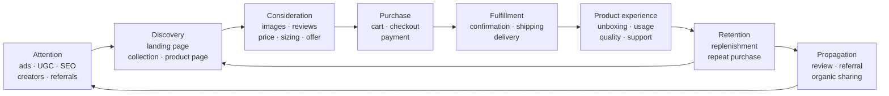

# Fixture: funnel engineering brainstorm

The end-to-end acceptance scenario for the Vivo integration. The flow under
test: start from an idea nugget in this conversation → explore by branching →
finish with (1) a visual exploration, (2) a final written piece, (3) a set of
Linear issues to start the project.

Provenance: pasted verbatim from a Codex conversation (2026-09). Immutable once
referenced by an acceptance run.

---

# Flesh out funnel engineering article

> help me flesh out an article please
>
> Attachment: "0→1 Is Just Funnel Engineering — At an early-stage startup, everyone is a funnel …"

This is already a strong article. The central idea is clear and memorable:

> 0→1 is the work of making one promise survive the journey from attention to retained value.

I would not rewrite it wholesale. I'd give it four more muscles: funnel math, small-sample experimentation, the danger of local optimization, and a concrete operating model.

## What to add

### 1. Soften the P0 claim without losing its edge

"If you cannot attribute your work to one of these things, it is probably not P0" is punchy, but invites easy counterexamples like infrastructure, hiring, reliability, and internal tooling.

I'd replace it with:

> Every P0 should either improve a conversion or improve the company's ability to learn which conversion matters.
>
> A database migration may not increase activation this week. But if unreliable data prevents the team from understanding activation, the migration is funnel work. Better internal tooling can be funnel work. Hiring can be funnel work. Reliability is absolutely funnel work if users reach the promise and encounter an error.
>
> The point is not that every task needs a growth metric attached to it. The point is that every priority should have a legible relationship to retained value or the speed at which the company learns how to create it.

That preserves the thesis while making it harder to dismiss.

### 2. Make the multiplicative nature of the funnel concrete

Add this early in "The science of funnel engineering":

> Funnels are multiplicative. If 10,000 people encounter the product and half advance through each of five steps, only 312 reach the end. A seemingly healthy conversion at every individual step can still produce a weak company.
>
> This is also why small improvements compound. Increasing one step from 50% to 60% does not merely improve that screen. It increases the number of users available to every step below it.
>
> But the goal is not to optimize every number simultaneously. It is to find the current constraint. If activation is broken, doubling traffic mostly doubles the number of people who fail to activate. If retention is broken, improving the paywall may simply create more short-lived subscribers.

The "current constraint" idea gives the article a more useful decision-making framework.

### 3. Account for how 0→1 teams actually experiment

"Run an experiment" currently sounds slightly too mature-company/A/B-test coded. Early startups usually lack sufficient volume.

After that paragraph, add:

> At 0→1, an experiment does not necessarily mean an A/B test. Most early-stage companies do not have enough traffic for statistically clean experiments, and pretending otherwise creates false confidence.
>
> An experiment might mean watching twenty people attempt onboarding. It might mean manually delivering the product's value to the first ten customers. It might mean calling everyone who completed setup but never returned. It might mean changing the promise for a week and looking for a qualitative difference in who arrives and what they expect.
>
> The scientific part is not the sample size. It is whether the team stated a belief clearly enough to be proven wrong.

That feels especially important because the article is about 0→1 rather than later-stage growth.

### 4. Add the local-optimization failure mode

This is the biggest missing section. It belongs immediately before "The company is the funnel."

## Every function can win while the company loses

> The reason the entire company has to think like a funnel engineer is that optimizing one conversion in isolation can make the overall system worse.
>
> Marketing can increase clicks by making the promise broader and more dramatic, while lowering activation because the people who arrive want a different product. Onboarding can increase completion by removing setup steps, while lowering retention because users never connect the data required to experience value. A paywall can increase short-term conversion through aggressive urgency, while increasing refunds and destroying trust.
>
> Every team can hit its local metric while the company produces fewer retained users.
>
> This is the organizational version of overfitting. Each function optimizes the surface it controls, but nobody protects the integrity of the journey.
>
> The shared metric cannot simply be clicks, signups, onboarding completion, or even payment. It has to be the deepest observable behavior that indicates the user received real value and is likely to return.
>
> Otherwise, the company is not operating one funnel. It is operating five disconnected dashboards.

That section turns the essay from an observation into an organizational argument.

### 5. Make "magic moment" operational

Right now the magic-moment examples are good, but the reader still needs a test for choosing one.

After "It is the POC of the vision," add:

> A useful magic moment has four properties:
>
> - It is observable. The team can identify whether it happened.
> - It is fast. A new user can reach it before their initial curiosity expires.
> - It is meaningful to the user, not merely evidence that they completed the company's setup flow.
> - It predicts something deeper: returning, paying, sharing, or expanding their use.
>
> If the team cannot instrument the magic moment, it is still a story. If reaching it does not predict retention, it may be memorable without being valuable.
>
> This distinction matters. Confetti after onboarding is not a magic moment. Generating something the user wants to keep might be. Connecting a calendar is not a magic moment. Avoiding a meeting because the product understood the calendar might be.

That last contrast is vivid and keeps the tone grounded.

### 6. Acknowledge that the funnel eventually becomes a loop

Near the end, add:

> "Funnel" is also an imperfect description because the best products eventually stop being linear.
>
> A retained user creates the next user through word of mouth, shared artifacts, invitations, collaboration, or simply by becoming proof that the product works. Product experience flows back into distribution. Retention changes the quality and cost of the next top of funnel.
>
> But before a company earns that loop, it has to complete one journey. One person has to encounter the promise, experience the proof, and decide the product is worth returning to.

This answers the predictable "good products are loops, not funnels" objection without surrendering the framing.

## Add a practical operating section

## Running the company as one funnel

> In practice, this does not require a complicated growth model. An early team can begin with five questions:
>
> 1. Who entered the funnel this week?
> 2. What did they believe they were going to receive?
> 3. How many reached the magic moment?
> 4. Where did everyone else stop?
> 5. Did the people who reached it come back?
>
> Then choose one constraint.
>
> If the wrong people are arriving, work on positioning and distribution. If the right people arrive but hesitate, work on the landing page or proof. If they sign up but never reach value, work on onboarding and product reliability. If they reach value but do not return, question whether the moment was sufficiently valuable or naturally repeatable.
>
> The whole company does not need to work on the same artifact. It does need to work from the same diagnosis.
>
> The marketer might change the promise. The designer might remove a decision from onboarding. The engineer might make the core action ten times faster. The founder might manually onboard five customers to understand where the model is wrong.
>
> Different work, same constraint.

## What I'd prune

There is some repetition between "The art of funnel engineering," "The company is the funnel," and "0→1 is the search for coherence." That repetition mostly works, but once the new sections are added I would trim around 10–15%.

- Keep "The crux of funnel engineering is making user expectation equal product experience."
- Keep all three examples beginning with "The marketing promised…"
- Keep "The first experience should not be a tour… It should be a guided path toward evidence."
- Cut one of the later explanations that product, growth, onboarding, and positioning are interconnected.
- Consider changing the final "And 0→1 is basically nothing else."

A sharper ending:

> The best early-stage teams do not tell the largest vision or build the most features. They make one clear promise, prove it as quickly as possible, and construct a path that lets the right person experience it.
>
> Everything else is downstream.
>
> That is funnel engineering. And that is most of what 0→1 actually is.

Subtitle:

> **A startup's first job is to make one promise survive the journey from attention to retained value.**

---

> do another pass please of "banger lines" and updating the tone and style please

Voice pass produced `0-to-1-is-funnel-engineering-v2.md` (2,435 words). The best new lines:

- "Users do not experience your org chart."
- "Every handoff is a place for belief to decay."
- "Funnels multiply. They do not add."
- "Launch creates attention. The product has to cash the check."
- "The empty text box is the company outsourcing product strategy to the user."
- "Most early-stage products do not suffer from a lack of capability. They suffer from a lack of choreography."
- "The magic moment is a receipt from the future."
- "Toy-but-real beats general-but-theoretical."
- "Local optimization is how a company gets five green dashboards and one dead product."
- "Retention is distribution with a delay."
- "Different work. Same constraint."

---

> I think the business intelligence is very similar to what I've been trying to make, especially with symphony (an effective agent harness that 1. Goes from idea to implementation and 2. Can do more than just coding i.e. research, docs, experiments, marketing material, etc.))
>
> the reason I am building all of this is to "scale my intelligence"
>
> -> implicit is my voice interface (some of the earlier versions had the mobile harness visibility, but this is the INTERFACE for human-agent(s)-interaction)
>
> -> symphony (or what I call dotfactory) is the agent harness underneath (where some of the things you discuss is super important — automating judgement (not just hardcoded PR review) + surfacing artifacts to the HIL
>
> If what scale is doing is truly this -> helping business owners/founders run more experiments; this is very much what I have been trying to do with my own internal system and what I think is the future (of everyone will have their own business + will need to scale intelligence)
>
> — ^ that is like my personal reasoning —
>
> for the actual thing I would want to push is thinking about the 0->1 experimentation work (we can discuss this in more detail) but I want to push this idea of "funnel engineering" as the cohesiveness of business intelligence (top of funnel to the product core loop OR sales conversion)
>
> see the image -> can we build out the: 1. general abstract version 2. the consumer app version 3. an ecom store version

Yes. The important move is separating your personal architecture from the general thesis.

Your personal architecture is:

- Implicit scales your ability to express intent and exercise judgment.
- Dotfactory scales execution, evaluation, and learning.
- Funnel engineering gives the whole system a business objective.

The public thesis is broader:

> Business intelligence should not be a dashboard. It should be a loop.

The unit of scaled intelligence is not an agent run. It is a closed experiment: a hypothesis becomes an intervention, reaches real people, produces evidence, receives judgment, and changes what happens next.

## 1. General abstract version



The abstract funnel becomes:

**attention → first contact → commitment → value → retention → propagation**

"Commitment" deliberately generalizes:

- Consumer app: install, account creation, trial, or payment
- Ecommerce: add to cart or purchase
- Sales-led business: qualified lead, booked call, pilot, or signed contract

"Value" comes after commitment because conversion is not proof that the business works. Someone paying once means you sold them. Someone receiving value means you may have a business.

The entire company becomes a machine for changing one of these transitions.

> The funnel is the shared coordinate system for business intelligence.

Without the funnel, agents produce disconnected work: research reports, ad concepts, product changes, and marketing material. With it, every artifact has a reason to exist.

## 2. Consumer app version



| Transition | Possible artifacts | Evidence |
|---|---|---|
| Attention → visit | UGC hooks, ads, creator briefs, channel experiments | Qualified CTR, cost per qualified visit |
| Visit → install | Landing page, App Store media, positioning, social proof | Install conversion |
| Install → activation | Onboarding, permissions, seed content, first task | Activation rate, time-to-value |
| Activation → magic moment | Workflow changes, generated output, reliability improvements | Magic-moment completion |
| Magic moment → payment | Paywall, trial, pricing, plan structure | Trial and paid conversion |
| Payment → core loop | Product improvements, lifecycle triggers, personalization | Core-action frequency, D7/D30 retention |
| Retention → propagation | Sharing, collaboration, referrals, exported artifacts | Invites and referred activation |

The paywall's position is itself an experiment. Some products need to demonstrate value before charging. Others need commitment before delivering an expensive experience.

The invariant is not the order of every screen. It is continuity of expectation:

> The person who clicked, the person who activated, and the person who retained should be trying to solve the same problem.

The consumer-app "magic moment" is the bridge between marketing and retention. Everything above it manufactures expectation. Everything below it tests whether the product fulfilled that expectation.

## 3. Ecommerce version



| Transition | Possible artifacts | Evidence |
|---|---|---|
| Attention → discovery | Ad creative, UGC, creator scripts, audiences, offers | Qualified sessions, CAC |
| Discovery → consideration | Product imagery, descriptions, comparison content, merchandising | Product-page engagement |
| Consideration → cart | Reviews, sizing, bundles, guarantees, shipping offer | Add-to-cart rate |
| Cart → purchase | Checkout flow, payment methods, free-shipping threshold | Checkout completion, AOV |
| Purchase → delivery | Confirmation, tracking, support automation | Delivery success, cancellations |
| Delivery → product value | Packaging, instructions, product quality, onboarding content | Returns, complaints, usage |
| Value → repeat purchase | Replenishment, lifecycle email/SMS, loyalty, cross-sell | Repeat rate, LTV |
| Value → propagation | Review requests, referrals, creator loops | Reviews and referred purchases |

The important difference from an app:

> Checkout is not the ecommerce magic moment. Using the product is.

A store that increases checkout conversion while increasing returns has locally optimized itself into a worse business. Returns are effectively negative activation. Repeat purchase is retention. Reviews and referrals turn retention back into top of funnel.

## The Dotfactory experiment contract

```yaml
business_goal:
current_constraint:
funnel_transition:
baseline:

hypothesis:
intervention:
artifacts:
audience:
exposure_plan:

primary_metric:
guardrail_metrics:
evaluation_window:

automated_judgment:
human_judgment_trigger:
decision:

evidence:
learning:
next_experiment:
```

Every agent artifact should point back to this object.

A research report is not "research completed." It supplies evidence for a hypothesis. An ad is not "creative completed." It is an intervention against attention → first contact. An onboarding change is not "feature shipped." It is an intervention against signup → magic moment. A retention email is not "lifecycle marketing completed." It is an intervention against value → return.

> The artifact is not the unit of progress. The closed experiment is.

## Where the three layers fit

- **Implicit is the human interface.** It captures unfinished intent, lets you steer from anywhere, surfaces the evidence that deserves attention, and asks for judgment at the right moment.
- **Symphony is the execution substrate.** It schedules and runs bounded agent work.
- **Dotfactory is the broader intelligence system.** It preserves intent, turns it into experiments, coordinates different kinds of agents, gathers evidence, applies bounded judgment, escalates consequential decisions, and retains the learning.
- **The funnel is the objective function.** It prevents scaled execution from becoming scaled randomness.

The human should not approve every artifact. That merely converts the founder from worker into reviewer. The harness should automate bounded judgment — correctness, attribution, thresholds, regressions, experiment integrity — and escalate taste, strategy, ambiguity, large spend, and irreversible decisions.

The resulting measure of "scaled intelligence" is not tokens, agents, or tasks completed.

> It is the number of good business experiments that can be closed per unit of human judgment.

Or, even more compactly:

> Implicit scales intent. Dotfactory scales execution and judgment. Funnel engineering makes both point at the business.
